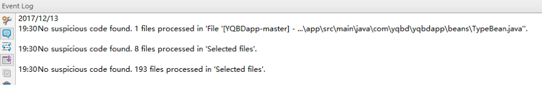
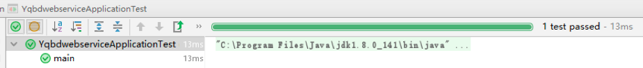

# GoOut志愿者任务发布平台

华东师范大学 计算机科学与软件工程学院

15级

| 姓名    | 学号        |     分工                  |  分数|
| ------ |-------------|---------------------------|---|
| 陈伟文  | 10152510217 | 项目经理，数据库设计，网页端开发| |
| 林佳乐  | 10152510208 | app开发，后端开发，服务器维护  | |
| 张启凡  | 10152510122 | 前端开发，软件测试，app开发    | |

[TOC]

## 引言

让我们产生要做这玩意的想法是上海志愿者网，实在是太烂了 - -!

从上图到下图经历了6s，实在是太卡了，点进去各种显示不全，而且没有移动端，现在这个时代谁整天用电脑。

吐槽谁都会，经常有人说“你行你上啊”，我上就我上。

### 开发目标

解决校园志愿服务各个环节痛点，推动校园志愿服务全过程 流畅进行，构建健康合理、优秀紧密的志愿服务资源整合平台，从校园 内部向校外扩充，以高校学生为主要参与者，集合高密度的志愿者资 源，为热心志愿服务的志愿者与对志愿服务有需求的团体或活动创造方 便合理的沟通交流平台，保持平台的持续服务与运维功效。 

### 主要功能

企业端或团体端(即需要志愿服务的一方)通过本平台发布 志愿服务活动详情及其需要人数和服务具体内容，个体端(即执行志愿 服务的一方，可以是学生个人的形式，也可以是被认证的志愿服务团队 的形式)通过本平台查看待处理的志愿服务活动，并与志愿服务招募信 息的发布者进行线上交流，志愿服务活动过程中有第三方机构进行活动 监督并在平台上反馈，志愿服务活动结束后，任务发布者和接收者在平 台上互相评价。

### 开发背景

随着时代的发展，志愿服务的社会意识深入人心。青年志愿者的力量对社会发展和相关文化活动不可或缺，作为高校学生，在日常的课业学习之外，能够参与到志愿服务这样的社会实践活动中，对我们是一种锻炼。同样，现今的志愿服务活动内容不再单单是曾经的福利院、敬老院的慰问看望活动，大型比赛的赛务志愿者，高级峰会的引导志愿者，特殊展览的翻译志愿者，更多类型的活动，更多数量的志愿服务形式让整合、交流志愿服务资源成为了迫切需要。以下从四个方面介绍一下具体要求:

#### 信息整合的要求

目前大量的志愿服务活动信息分散在各个平台，且平台种类、大小不一，如微信公众号和网站并存，同一个活动不同级
别的组织覆盖人群有重叠导致报名信息混乱。
  

#### 用户体验的要求

分散的志愿信息发布渠道导致不少热心志愿服务的同学错过活动报名留下遗憾。微信公众号和网页表单的报名方式用户使用体验较差，且发布者的收集耗时较大，容易疏漏，造成不必要的误会。

#### 活动甄选的要求

当前志愿服务数量虽然很多但是质量参差不齐，且多数的志愿服务活动在策划和组织方面没有一个较好的标准，导致志愿服务的开展遇到障碍，造成不必要的资源浪费。本平台对于志愿服务活动的评价系统就可以很好的解决这样的问题，对发布志愿服务活动的企业或团体有发布活动质量的综合评价，对参与志愿服务活动的接收者有志愿服务能力的综合评价，通过平台使用者双方的努力，本平台致力于设立志愿服务活动鉴别的标准，便于志愿服务活动的甄选和发展。
  
#### 个人体验的要求

多数志愿者在从事志愿服务活动的过程中会发现不同的志愿服务岗位是同样的活动津贴，某些岗位做得不好会招来活动其他参与者的非议，这对于志愿服务活动的健康发展是非常不利的，为了尽可能减少志愿经历与付出不等的事件发生，本平台注重志愿服务活动全过程的透明和第三方的活动监督。

## 系统目标和开发可行性

### 系统目标
- 完成一个精选、线下、志愿活动的免费信息发布平台。实现对分散 志愿活动信息的收集和发布，并实现“团体上传”与“审核”相匹配的信息收 集渠道建设。
- 使用手机移动 app 的信息发布平台，以良好高效率的界面设计来实 现优雅的用户体验和高效率的处理用户需求。

### 开发可行性

#### 1. 技术可行性:

- 采用 AES 和 MD5 加密技术来加密用户信息，在信道不被窃听 的的情况下保证数据传输的安全，同时采用 base63 编码的方式编 码 TOKEN 令牌来保证安全性。
- 基于 Java 的 MVC 设计模式，采用 Android 和 J2EE 的后台技术，MVC 为这套系统的主流设计模式，同时采用代理模式和观察 者模式进行部分代码编写，设计模式多样化。
- 采用 git 版本控制工具和 Github 仓库进行版本控制，很常见 了，避免压缩包传来传去。github链接: https://github.com/JialeNilengma/yqbdwebservice

#### 2. 经济可行性:

- 需要一个服务器和云端的数据库(目测就是腾讯云或者阿里云了)，数据库和服务器必须分离，经过一次次血的教训，数据库 和服务器放在一起定期数据库崩溃。在开发过程中可以使用本地 环境代替，经济压力较小，当然如果用户量爆炸另说。
- 只有 app 端和 web 端，不涉及硬件，不需要线下部署，省去 了繁琐的行政流程，宣传的时候需要一些成本罢了。

#### 3. 管理可行性:
- App 端方面:采用简洁的 UI 设计模式，使用户使用便捷，避免了大量的一层套一层的冗余点击，让用户快速查询到各类任务，快捷接到任务。
- web 网页端进行志愿活动的管理和审核，不受限于安卓繁杂的步骤，同时可以进行精密的图文编辑，满足活动发布者的需求。

#### 4.开发环境可行性

- 所有开发成员均使用 Android Studio/IDEA 进行 APP 端的开发。
- 同时web service 使用 IDEA 进行开发。
- Jet Brains 大法好，IDEA 出来 后 eclipse 几乎就下岗了，还跨平台。

## 现行系统概况

### A.现行系统现状调查说明

#### 1. 组织机构图

#### 2. 系统目标

完成一个精选、线下、志愿活动的免费信息发布平台。实现对分散志愿活动信息的收集和发布，并实现“团体上传”与“审核”相匹配的信息收 集渠道建设。使用手机移动 app 的信息发布平台，以良好高效率的界面 设计来实现用户体验的需求。

#### 3. 功能一览表

#### 4. 业务流程图

#### 5. 薄弱环节

- 在没有用户流量的基础下，很难主动吸引公司和广告投放，所
以一开始的客户吸引全需要通过人工洽谈完成。
- 活动质量的审核没有一个恰当的标准，实名验证暂时没有得到
验证的接口。
- 线下活动无法进行监督，我们只提供了一个线上的沟通和交流
的平台。

### B.系统需求说明

#### 1. 用户需求

用户需要一个有信息整合性的操作方便的移动端 app，据调查，市面上大多官方志愿者活动机构只有 web 端或者微信端，app 市场为空 白，而且志愿活动质量良莠不齐，存在志愿活动数量多但是质量低，回 报少的特点，用户总体上有四个需求:信息整合，用户体验，活动甄选 和个人体验。同时，用户需要实时能与活动的搭建者进行交流沟通，获 取保障能够获得足够的收益和积累。

#### 2. 主要存在的问题

- 客户流量不够大。
- 志愿活动信息不够多(可能用爬虫抓取)。 
- c)活动审核和个人/官方机构的审核。 
- 智能分配任务到特定的用户组。

## 新系统的逻辑方案

### 1. 新系统拟定的业务流程及业务处理方式

### 2. 新系统拟定的数据流程(U/C矩阵)

|            | 企业序号 | 志愿任务标签 | 志愿任务内容 | 个人用户序号 | 消息记录 | 志愿任务状态 | 任务执行者 | 任务完成情况 |
|------------|---------|-----------|------------|------------|---------|-----------|------------|-----------|
| 注册企业用户 | C       |           |            |            |         |           |            |           |
| 发布志愿任务 | U       |     C     |            |            |         |           |            |           |
| 修改志愿任务 | U       |     U     |      C     |            |         |           |            |           |
| 注册个人用户 |         |           |            |     C      |         |           |            |           |
| 接受志愿任务 |         |     U     |      U     |     U      |         |           |            |           |
| 收藏志愿任务 |         |     U     |      U     |     U      |         |           |            |           |
| 取消志愿任务 |         |     U     |      U     |     U      |         |           |            |           |
| 聊 天 通 讯 |     U   |     U     |            |     U      |    C    |           |            |           |
| 审核志愿任务 |     U   |     U     |      U     |            |         |     C     |            |           |
| 线下活动监督 |         |     U     |            |            |         |     U     |            |     U     |
| 纠 纷 处 理 |    U    |     U     |      U     |            |         |     U     |      C     |     U     |
| 推 广 活 动 |         |     U     |      U     |            |         |           |            |     C     |



### 3. 新系统的逻辑结构及数据资源分布 

#### 逻辑结构
| 表示层 | 任务的发布接受 | 个人信息修改 | 实名登记 |
|---|---|---|---|
|业务层 | 拦截器拦截|中间数据传输|动态监听推送|
|持久层|任务信息返回|更新任务状态|更新返回通知|

### 4. 新系统拟采用的管理方式

- **后台管理员对志愿活动发布的管理**： 所有发布的任务都要经过后台管理员的通过，以实现志愿活动的真实性和有效性的审核，同时后台管理员和发布者本身具有修改
- **管理员对用户组的管理**： 针对不同的用户组可以进行不同的推送相关志愿活动，同时可
以对用户组的人员变动进行管理，审核一些官方认定的用户组织， 修改信用评分。
- **任务状态的管理**： 任务有若干个状态，基本状态由数据库触发器影响改变，进一步的状态由后台人员修改管理。

### 5. 新系统拟采用的算法

- 图像的二次缓冲
- Socket 的即时监听 
- 安卓全代理的网络访问技术，免去了线程操作

### 6. 与新系统相适应的管理制度 
志愿活动的状态一般使用触发器进行直接更新，在涉及公司端和企业端更新时，需要特定有权限的人进行更新状态。所有志愿活动都要经过后台的人工审核。

### 7. 系统开发资源与时间进度估计
腾讯云服务器，腾讯云数据库，IDEA 和 android studio 开发。第十一周之前做好 app，第十四周之前做好网页端，十六周完成基本对接并投入运营。


## 系统设计报告

### (一)概要设计

主要解决子系统的划分与确认、模块结构设计、网络设计和配置方案等问题。 

1. 子系统划分:是将一个复杂的系统设计转为若干子系统和一系列基本模块的设计，并通过模块结构图把分解的子系统和一个个模块按层次结构联系起来。我们将整个项目系统划分成移动端和网页端。移动端首先尝试Android App。
2. 模块结构设计:是对各个子系统进行细化，确定划分后的子系统的模块结构，并画出模块机构图。 
	移动端：用于个人用户和团体用户的使用。
	网页端：用于企业用户的志愿服务活动发布。
3. 网络结构设计与设备配置方案: app端和web端使用MySql作为数据库支持。

### (二)详细设计
主要解决代码设计、输出设计、输入设计、处理过程设计、数据库设计、人机界面设计、安全控制设计等问题。
1. 代码设计:是要设计出一套能为系统各部分公用的、优化的信息编码系统。在安卓端我们采用java编码规范，将数据库和后台交互的代码通过代理模式进行annotation注入，使得后台可以直接调用mapper中的函数。在网页端将图表进行javascript封装，显示近几日的访问量。
2. 输出设计:是根据管理和用户的需要进行的各种操作、请求，html端类报表输出。

如：企业端查询任务时的输出



申请者列表输出：



3. 输入设计:可以进行多因子找寻想要的志愿者服务，如根据承办单位进行搜索，也可以在给予权限的情况下通过单例任务来查看接收者，和志同道合的人同时接受同一个任务。

4. 处理过程设计:



5. 数据库设计:

主要的表有:

	Userinfo用户表
	CompanyInfo企业表
	Task任务表
	Type任务类型表
	UserTake用户表和任务表中间表
	CompanyTake企业表和任务表中间表
	TaskType 任务和任务类型中间表
	Comment评论表



 6. 人机界面设计:

app端

 
 

网页端





## 系统功能测试报告

### 1. 概述
本接口说明书详细说明了GoOut志愿者平台系统功能测试报告。用户在开发GoOut志愿者平台系统时必须阅读该说明书。

| 软件名称: | GoOut志愿者平台 | 软件版本: | 1.0.0  |
| -------- |---------------| ---------|-------|
| 开发经理： |陈伟文     |开发截止日期：|2017.12.11|
| 测试人员: |林佳乐、张启凡 | 测试日期: | 2017.12.11 |
| 测试内容：| 网页端和安卓端的功能|
| 备注：|

### 2. 测试环境

| 用途 | 硬件环境 | 软件环境 |
| --- | ------- | ------- |
|网页端测试 | Surface pro7,ThinkPad E450 | Chrome,centos7.0,mysql 5.7,windows 10|
| 安卓端测试 | 华为手机 | Android 7.0,centos7.0,mysql 5.7|


### 3. 测试方案及结果

（1）	使用Alibaba编码规约进行安卓端静态代码测试。测试结果如下：



没有构成Error的编码错误，大多数是编码风格上的注释缺失，常量定义遗漏。
修改后的结果：



（2）	使用JUnit进行单元测试。测试结果如下：






1 test passed


### 4. 测试综述
 本轮测试持续将近1周，到目前为止发现的Blocker数据量 122个，其中，重新开启：0 个，未解决：0个，已解决：122个。该轮测试通过，鉴于Debug结果没有Warning和动态测试的结果，基本达到预期的系统设计要求，不需要做回归测试或验证测试。
 
### 5. 问题与建议
建议升级服务器配置，提高服务器稳定性。


## 总结

本次实验主要完成了一款基于android平台的志愿者任务发布平台的设计与实现以及一款网页管理工具。提出了android用户界面设计、获取并解析任务列表数据的办法，给出了在用户界面上的原理与实现过程，最后通过安卓手机进行调试以及静态测试。

本程序能实现近期的志愿者项目展示接受功能，有良好的稳定性及扩展性，但是有待完善的地方依然很多，未来改进时可以考虑一下几点:添加完成任务之后打打分和点评系统，增加个人信用等级和企业信用等级的评分，在程序中内嵌聊天系统。

感谢王老师和助教给予我们团队的帮助！